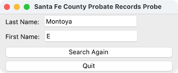

# Instructions for n_sfprob.py

**n_sfprob.py** is a python script that commands the Chrome web browser to login to the Santa Fe County probate records and search for all records for certain last name and first name. It runs on a computer, not a mobil device. As of this writing:

* last name = Montoya
* first name = E

This results in all probate records where the last name is Montoya and the first name starts with the letter E.

## Requirements

* python3
* pip  
* selenium  (The python library for commanding the Chrome web browser)

## Installation

* **Python3** might already be on your computer. To find out, open a Terminal window and issue the command: **python3 --version**
* The installed python3 version number will show up. If not then open a web browser and goto <https://www.python.org/downloads/>. Follow the directions to install python3. **Python 3.12.0** is what was used when testing **n_sfprob.py**.
* **Pip** is a utility for python that manages python library installations. It might be already installed and it might not be already installed. **Pip** is required for installing **Selenium**. Ensure that your installed python version has Pip by issuing this command in a **Terminal** window: **python3 -m ensurepip --upgrade**
* **Selenium** is likely not installed on your computer. Once you have python installed, open a Terminal window and issue the command: **pip3 install -U selenium**
  
## Running n_sfprob.py

* Open a Terminal window.
* Change the current working directory to the directory that contains the n_sfprob.py file.
* Issue the command: python3 sfprob.py
A new Chrome browser opens. The Santa Fe County website will open and be logged in as public going to the probate records search page. The records search will be issued.
In addition to the Chrome browser window showing the query results you should see the following window:

### Using n_runprob.sh to run n_sfprob.py

The shell script n_runprob.sh is provided as an alternate way to run n_sfprob.py. Its advantage is that using it takes less typing. First you need to mark the file as executable. You only need to do this once.

* Open a Terminal window.
* Change the current working directory to the directory that contains the **n_runprob.sh** file.
* Issue the command: **chmod +x n_runprob.sh**
  
### Now to run sfprob.py you

* Open a Terminal window.
* Change the current working directory to the directory that contains the **sfprob.py** file.
* Issue the command: **./n_runprob.sh** (That starting “.” is necessary.)
* N_runprob.sh issues the command python3 sfprob.py for you.

### Tip

* Keep the same Terminal window session open from day to day. This keeps the python session that shows the little window running. You can hide both windows or hide just the Terminal window. There is nothing for you to do at the Terminal window. The Terminal window does report the automation steps. You can close the Chrome browser after seeing the probate search. A new Chrome browser instance will be loaded the next time you perform the search.
* Any time you want to run the probate probe just press the Search Again button.

* Pressing the Quit button, or closing the interface (ie. using the Red dot), or closing the Terminal window each terminates the automation session.
